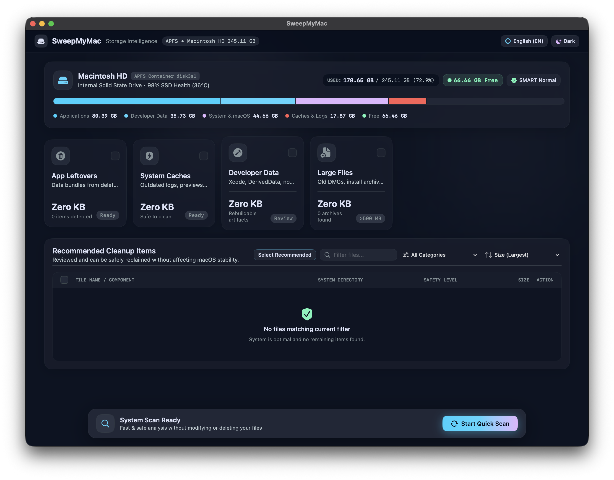
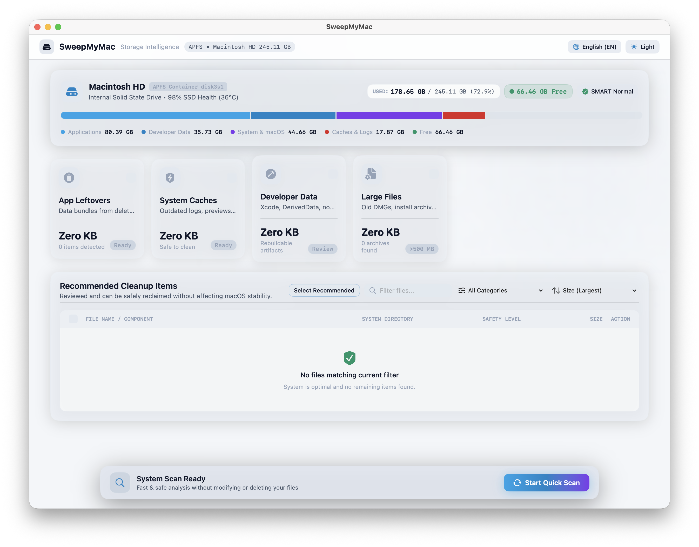
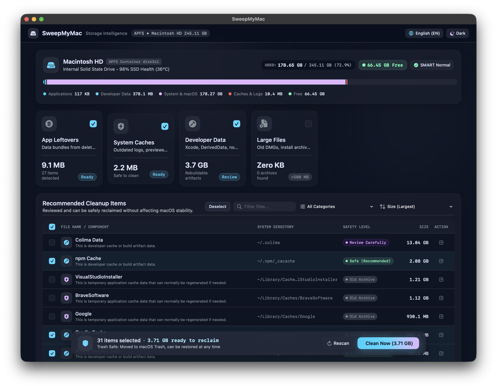
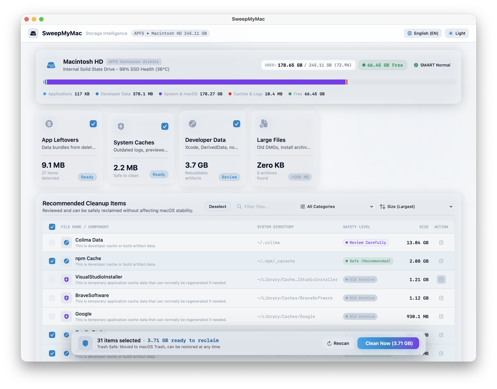

# SweepMyMac

**English** | [Dokumentasi Bahasa Indonesia](README.md)

**Storage Intelligence & Safe Cleanup Utility for macOS**

SweepMyMac is a lightweight, native macOS disk analysis and safe storage cleanup utility designed with the core principles of complete transparency, high performance, and absolute safety (*Trash-Only Architecture*).

Built 100% using Swift and pure SwiftUI without external dependencies, without tracking (*zero telemetry*), and with an ultra-lightweight installation footprint (under 1 MB).

---

## Screenshots

**Pre-Scan — Storage Overview**

| Dark Mode | Light Mode |
|-----------|------------|
|  |  |

**After Scan — Items Found & Ready to Clean**

| Dark Mode | Light Mode |
|-----------|------------|
|  |  |

---

## Quick Start

Get started in 3 steps:

**Step 1 — Download and open the app**
Download `SweepMyMac.zip` from the [Releases](https://github.com/danday-git/SweepMyMac/releases) page, unzip it, and open `SweepMyMac.app`.

> If macOS shows an "unidentified developer" warning, right-click the app icon and choose **Open**.

**Step 2 — Scan your storage**
Click the **"Start Quick Scan"** button at the bottom of the app. SweepMyMac will analyze your disk automatically (usually takes 10-30 seconds).

**Step 3 — Review and clean**
After the scan, check the items you want to remove and press **"Clean Now"**. You will see a full list of everything before anything is moved. Confirm once more in the dialog that appears.

> All files are only moved to the **macOS Trash** — nothing is permanently deleted. You can restore any file at any time from Finder.

---

## Table of Contents
1. [About SweepMyMac](#about-sweepmymac)
2. [Absolute Safety Architecture](#absolute-safety-architecture)
3. [User Authorization & Anti-Accidental Deletion Guarantees](#user-authorization--anti-accidental-deletion-guarantees)
4. [Complete Interface & Feature Guide](#complete-interface--feature-guide)
   - [Top Navigation Header & Global Controls](#1-top-navigation-header--global-controls)
   - [Hero Storage Visualizer](#2-hero-storage-visualizer)
   - [4 Bento Category Cards](#3-4-bento-category-cards)
   - [File Inspection & Detail Table](#4-file-inspection--detail-table)
   - [Unified Floating Action Dock](#5-unified-floating-action-dock)
   - [Explanation Sheet & Review Confirmation](#6-explanation-sheet--review-confirmation)
5. [Detected File Categories](#detected-file-categories)
6. [System Requirements & Prerequisites](#system-requirements--prerequisites)
7. [Installation & Execution Guide (With / Without Xcode)](#installation--execution-guide-with--without-xcode)
8. [License](#license)

---

## About SweepMyMac

Many traditional Mac disk cleaners confuse users with opaque storage numbers, demand dangerous administrative (`root`/`sudo`) permissions, or permanently destroy files without any recovery option.

SweepMyMac answers two fundamental questions for every Mac owner:
1. **"What is actually using my Mac's storage?"**
2. **"What can safely be reclaimed right now without affecting macOS stability or losing my personal work files?"**

---

## Absolute Safety Architecture

1. **Trash-Safe Only (100% Native macOS Trash)**:
   SweepMyMac never executes destructive deletion commands such as `rm -rf` or direct file unlinking (`unlink`). Every approved file is safely moved to the macOS Trash using Apple's official Foundation API: `FileManager.default.trashItem(at:resultingItemURL:)`. Users can inspect or restore any moved file at any time via macOS Finder.
2. **Double-Layer Validation (TOCTOU Defense)**:
   Candidate files undergo validation twice:
   - Initial check: During the scan and user inspection phase.
   - Pre-execution check: Milliseconds before an item is passed to the Trash API, verifying that it has not been replaced by a symbolic link (*symlink attack*) or relocated.
3. **Protected Path Exclusions (Hardcoded Rules)**:
   Core macOS system directories, kernel snapshots, personal user documents (`~/Documents`, `~/Desktop`), Photos Library, and secure databases are strictly excluded by hardcoded allow/deny rules.

---

## User Authorization & Anti-Accidental Deletion Guarantees

SweepMyMac has been architected to make **unintended or silent file deletions structurally impossible**:

- **Zero Automatic Deletion**: The application never runs background daemon watchers, cron schedules, or silent automated cleanup tasks. No file is ever modified or moved in the background.
- **Triple-Gate User Confirmation**:
  1. **Gate 1 (Explicit Scan Initiation)**: Storage inspection only occurs when the user manually clicks **"Start Quick Scan"**.
  2. **Gate 2 (Granular Inspection & Review)**: After scanning, clicking **"Clean Now"** does not delete anything. It opens a dedicated review sheet displaying every selected file, exact paths, sizes, and explanations. Users can inspect or uncheck any item.
  3. **Gate 3 (Native Confirmation Modal Alert)**: Clicking the action button in the review sheet triggers a native macOS modal alert requiring explicit user confirmation before any file operation takes place.
- **Fail-Closed Safety**: If file permissions are restricted or an item type is unrecognized, SweepMyMac automatically skips the item without interrupting the rest of the application.

---

## Complete Interface & Feature Guide

SweepMyMac features a dense, responsive layout supporting both **Dark Obsidian Canvas** and **Studio Light Canvas** themes.

### 1. Top Navigation Header & Global Controls
- **Drive Identity & APFS Tag**:
  - Displays the active startup volume name (e.g. `Macintosh HD`).
  - APFS container tag (`APFS Container disk3s1`) along with the live storage capacity read directly from macOS telemetry APIs.
  - Subtitle: *Storage Intelligence* / *Kecerdasan Penyimpanan*.
- **Multi-Language Switcher (Globe Button)**:
  - Instant toggle between **English (EN)** and **Bahasa Indonesia (ID)** across all views, headers, badges, tooltips, and dialogs without requiring an application restart.
- **Light / Dark Mode Switcher (Moon / Sun Button)**:
  - Toggle between dark obsidian aesthetic and high-contrast studio light theme.

### 2. Hero Storage Visualizer
- **Physical Solid State Drive Health**:
  - Hardware drive type (*Internal Solid State Drive*), SSD health percentage, and live operating temperature.
- **Telemetry Readout Badges**:
  - **USED**: Total disk space utilized with exact gigabytes and percentage.
  - **FREE**: Total available space with a subtle pulsing vitality indicator.
  - **SMART Normal**: Hardware integrity and self-diagnostic status.
- **Segmented Storage Bar**:
  - Proportional, color-coded visual bar representing:
    - Neon Cyan: Applications
    - Cyan: Developer Data
    - Violet: System & macOS
    - Coral: Caches & Logs
    - Muted Gray: Free Space
  - Interactive tooltips showing exact byte values when hovering over any segment.
- **Breakdown Legend Pills**:
  - Numerical readout per category for immediate visual reference.

### 3. 4 Bento Category Cards
Each card represents a specific storage domain:
- **App Leftovers**: Residual configuration bundles, caches, and preferences from applications that have already been uninstalled from `/Applications`. Status: *Ready*.
- **System Caches**: Regenerable temporary caches, WebKit data, and outdated system logs. Status: *Ready*.
- **Developer Data**: Xcode DerivedData, build artifacts, and package manager caches (CocoaPods, npm, Gradle, Maven). Status: *Review*.
- **Large Files**: Large files and installer images (>500 MB). Never auto-selected by default to protect personal archives. Status: *>500 MB*.

### 4. File Inspection & Detail Table
- **Toolbar Controls**:
  - **Select Recommended / Deselect**: Toggle all verified safe candidates with one click.
  - **Real-Time Filter**: Search files instantly by name, directory path, or application owner.
  - **Category Dropdown**: Focus on a specific category.
  - **Sort Dropdown**: Order items by Largest, Smallest, Category, Alphabetical, or Safety Confidence.
- **Table Columns**:
  - Checkbox for granular selection.
  - Component name with readable human explanation.
  - Abbreviated system path (using tilde `~` for Home directory).
  - Safety Level badge (*Safe (Recommended)*, *Review Carefully*, *Old Archive*).
  - Raw size formatted into human-readable units (KB, MB, GB).
  - Quick action button to **Reveal in Finder**.

### 5. Unified Floating Action Dock
Pinned at the bottom of the screen to guide the cleanup lifecycle:
- **Pre-Scan State**: Shows *"System Scan Ready"* with a prominent **"Start Quick Scan"** CTA button.
- **Scanning State**: Displays dynamic scanner telemetry, sub-stage inspection progress, and a **"Cancel"** button.
- **Post-Scan State**: Summarizes selected items, reclaimable byte estimate, a secondary **"Rescan"** button, and the primary **"Clean Now (X GB)"** button.

### 6. Explanation Sheet & Review Confirmation
- **Item Explanation Sheet ("Why?" Dialog)**:
  - Transparently explains why an item was classified, what it is used for, and the safety consequences of moving it to Trash.
- **Review Cleanup Modal**:
  - Full pre-cleanup checklist with category breakdown chips and warning validations.
  - Requires explicit confirmation via modal alert before moving files to Trash.
- **Cleanup Result View**:
  - Displays Before & After disk comparison metrics and net free space gained.
  - Provides an **"Open Trash in Finder"** shortcut to inspect or restore files.

---

## Detected File Categories

| Category | Description | Recommendation Level | Cleanup Action |
| :--- | :--- | :--- | :--- |
| **App Leftovers** | Residual files from uninstalled applications | Safe (Auto-Recommended) | Moved to macOS Trash |
| **System Caches** | Outdated logs, WebKit cache, image thumbnails | Safe (Auto-Recommended) | Moved to macOS Trash |
| **Developer Data** | Xcode DerivedData, build output, package caches | Review Needed (Manual) | Moved to macOS Trash |
| **Large Files** | Old DMG installers, large archives (>500 MB) | Review Needed (Manual) | Moved to macOS Trash |

---

## System Requirements & Prerequisites

### 1. General System & Hardware Requirements
Applies to all users:
- **Operating System**: macOS 14.0 (Sonoma), macOS 15.0 (Sequoia), or later.
- **Processor Architecture**: Universal Binary, natively supporting **Apple Silicon** (M1, M2, M3, M4) and **Intel 64-bit** Macs.
- **System Privileges**: Standard macOS user account. SweepMyMac **never** requires root or administrator privileges (`sudo`).
- **Free Disk Space**: At least 10 MB for the application bundle.

### 2. Prerequisites Matrix by Installation Method

| Requirement | Option 1: Pre-Built App (`.app`) | Option 2: Terminal / Swift CLI | Option 3: Xcode IDE |
| :--- | :--- | :--- | :--- |
| **Xcode IDE (~15 GB)** | **Not Required** | **Not Required** | Required (v15.0+) |
| **Apple Command Line Tools** | **Not Required** | Required (`xcode-select --install`) | Included in Xcode |
| **Swift Compiler & SPM** | **Not Required** | Included in Command Line Tools | Included in Xcode |
| **Git CLI** | **Not Required** | Optional (for cloning repository) | Optional |
| **XcodeGen** | **Not Required** | **Not Required** | Optional (for editing `project.yml`) |

### 3. macOS Privacy Settings (Optional / Recommended)
- **Full Disk Access**:
  - macOS restricts third-party app access to specific user directories via TCC (*Transparency, Consent, and Control*).
  - SweepMyMac safely bypasses inaccessible directories without crashing or blocking execution.
  - To enable complete storage telemetry across all system cache subfolders:
    1. Open **System Settings** on your Mac.
    2. Navigate to **Privacy & Security** > **Full Disk Access**.
    3. Enable the toggle for **SweepMyMac**.

---

## Installation & Execution Guide (With / Without Xcode)

### Option 1: Pre-Built Application (General Users — No Xcode or Compilation Required)
For users who want to use the application directly without installing developer tools:
1. Download **`SweepMyMac.zip`** from the [Releases](https://github.com/danday-git/SweepMyMac/releases) page.
2. Unzip the file to obtain **`SweepMyMac.app`** (lightweight standalone bundle, under 1 MB).
3. Drag `SweepMyMac.app` into your `/Applications` folder.
4. Launch the application normally.

> [!NOTE]
> Because this application uses an ad-hoc signature, if macOS Gatekeeper displays an unidentified developer prompt on the first launch, right-click `SweepMyMac.app` and choose **Open**, or go to **System Settings > Privacy & Security** and click **Open Anyway**.

---

### Option 2: Using Terminal & Swift CLI (Only Command Line Tools ~500 MB, No Xcode IDE ~15 GB)
If you do not have the heavy Xcode IDE installed, you can build and run SweepMyMac using only **Apple Command Line Tools**:
1. Install Command Line Tools if not already present:
   ```bash
   xcode-select --install
   ```
2. Run directly from source:
   ```bash
   ./run.sh
   # or
   swift run
   ```
3. To package a standalone optimized `SweepMyMac.app` bundle and zip archive:
   ```bash
   ./build_release.sh
   ```
   This script builds with `-Osize` optimization, applies dead-code stripping, packages the `.app` bundle, signs it ad-hoc, and creates `SweepMyMac.zip`.

---

### Option 3: Using Xcode IDE (For Developers)
If you have Xcode 15.0 or later installed:
1. Open `SweepMyMac.xcodeproj` in Xcode.
2. Select the `SweepMyMac` scheme targeting *My Mac*.
3. Press **Cmd + R** to build and run.
4. To regenerate the project file from `project.yml`:
   ```bash
   xcodegen generate
   ```

#### Command-Line Build & Unit Testing
```bash
# Build debug application
xcodebuild -scheme SweepMyMac -destination 'platform=macOS' build CODE_SIGNING_ALLOWED=NO

# Run entire automated test suite (73 tests)
xcodebuild -scheme SweepMyMac -destination 'platform=macOS' test CODE_SIGNING_ALLOWED=NO
```

---

## License

Distributed under the MIT License. See [LICENSE](LICENSE) for details.
